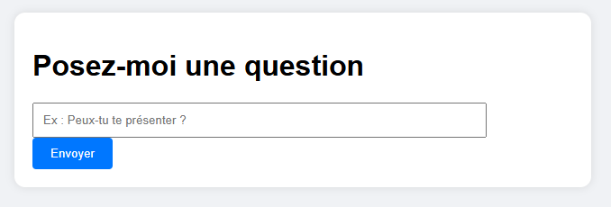
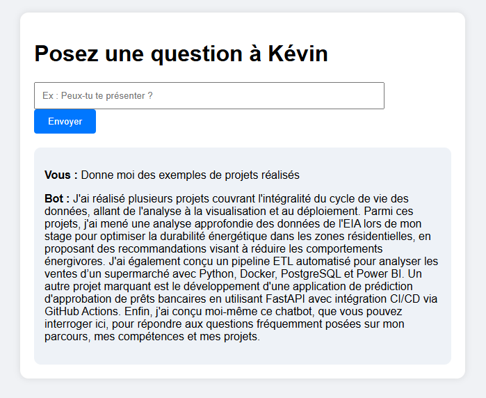

# Chatbot 

Ce projet consiste en un chatbot utilisant le traitement du langage naturel (NLP) et FastAPI pour répondre aux questions fréquemment posées sur mon parcours professionnel, mes compétences, et mes projets.

Il permet aux recruteurs ou toute autre personne intéressée de poser des questions sur mon profil et d'obtenir des réponses automatiques et pertinentes.

Le chatbot est disponible ici (si actif) : https://chatbot-cv.onrender.com/

## Fonctionnalités

- **Réponses automatiques** : Le chatbot est capable de répondre à une série de questions prédéfinies concernant mon parcours, mes projets, mes compétences, et d'autres aspects professionnels.
- **Utilisation de NLP** : Utilisation de TF-IDF et de similarité cosinus pour trouver la réponse la plus proche à la question posée.
- **Interface web** : Une interface simple permettant d'interagir avec le chatbot en temps réel via un navigateur web.

## Galerie

Voici un aperçu de l'interface utilisateur :

  

Exemple de question-réponse :

  

